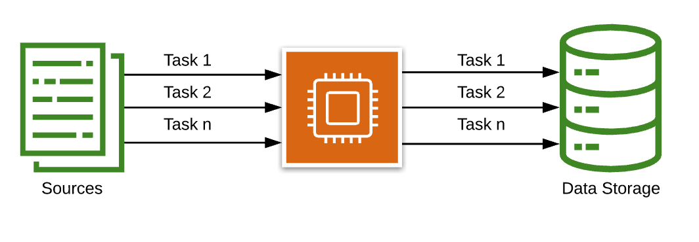
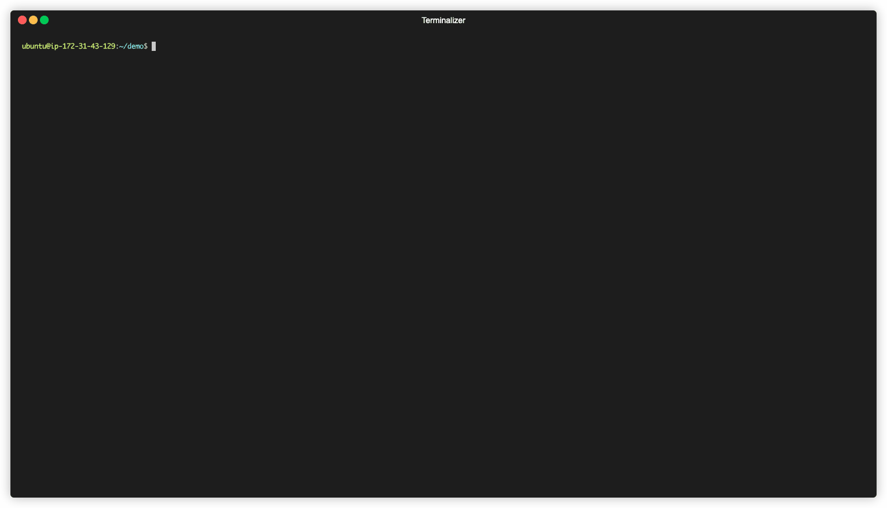
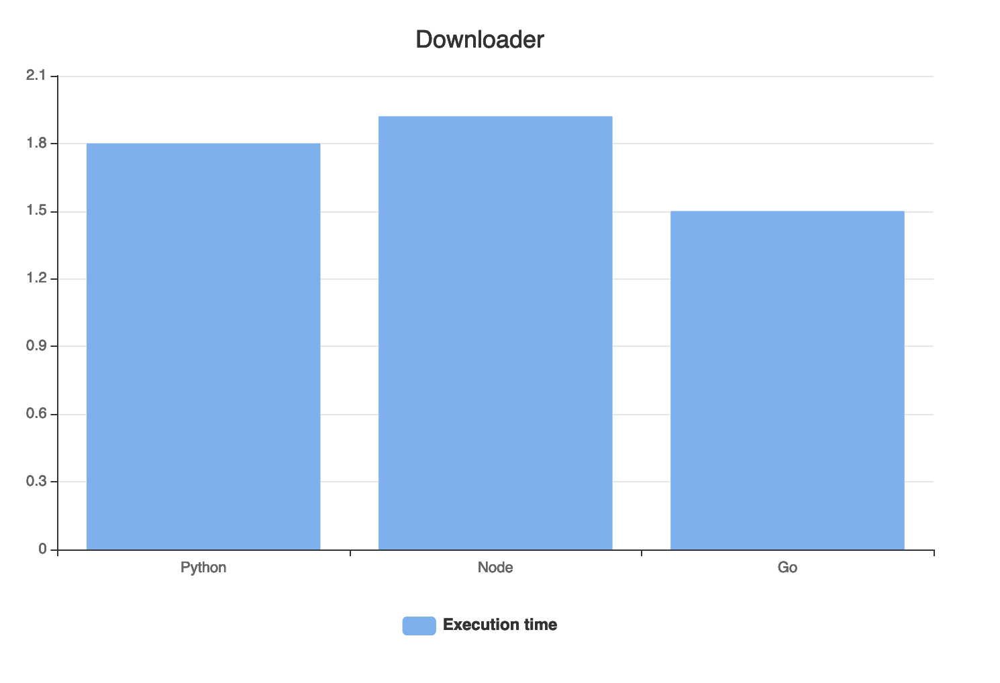
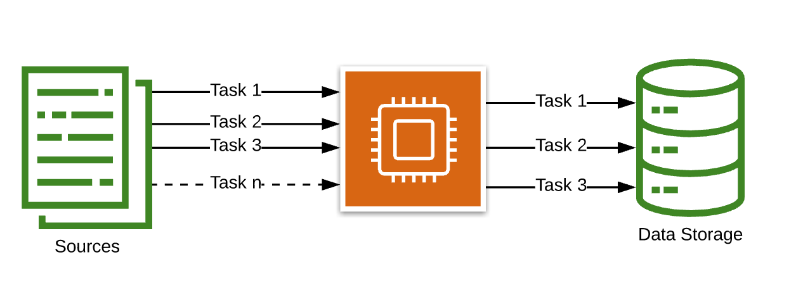
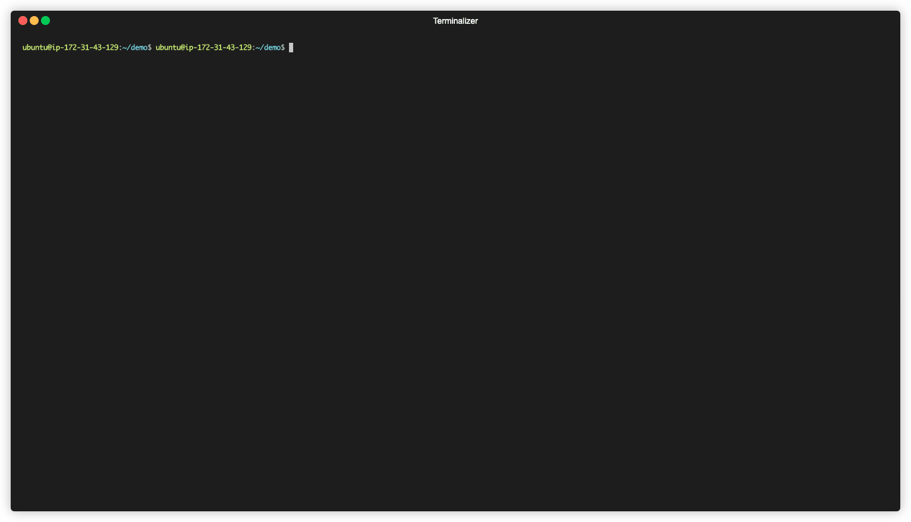
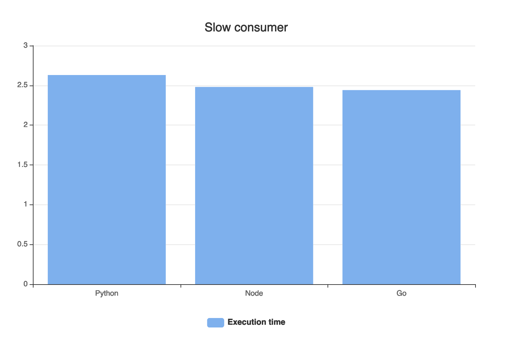
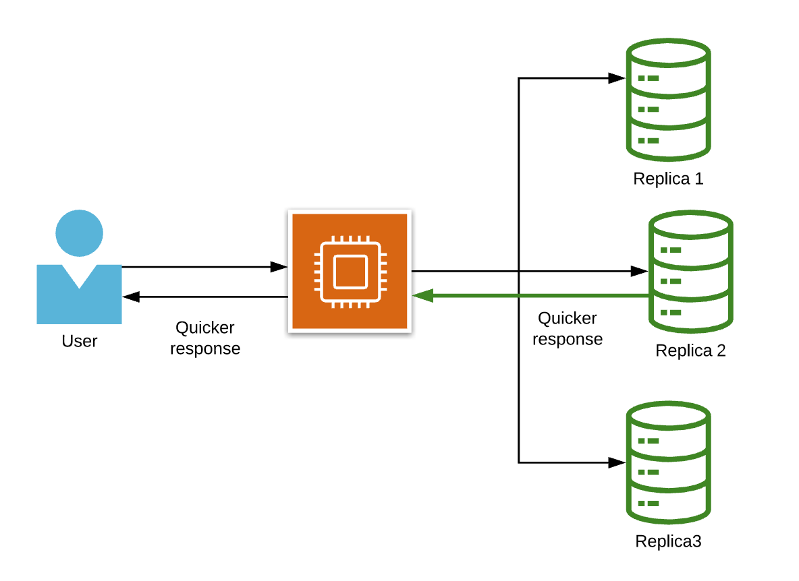
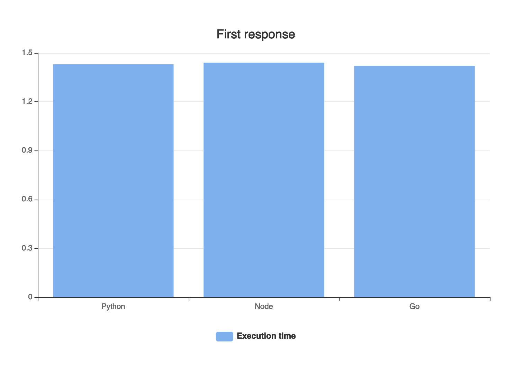

# Language for cloud infrastructure 

This repository contains the [presentation](https://www.slideshare.net/YaroslavMuravskiy/programming-language-for-the-cloud-infrastructure-238708126) and sample codes written in Go, Python, Node 
which demonstrates how to resolve some tasks using concurrency.  

## Downloader

### Description 

Create an asynchronous program for downloading and storing content.

### Workflow task schema

### Execution

### Benchmark

## Slow consumer

### Description 

Create an asynchronous program for downloading and storing content. 
Consider that only three consumers can run simultaneously and 
a producer shouldn't start a download process if all consumers are busy.  

### Workflow task schema

### Execution

### Benchmark

## First response

### Description 

Create an asynchronous program for getting the first response from the multiple replicas.  

### Workflow task schema

### Execution

### Benchmark

